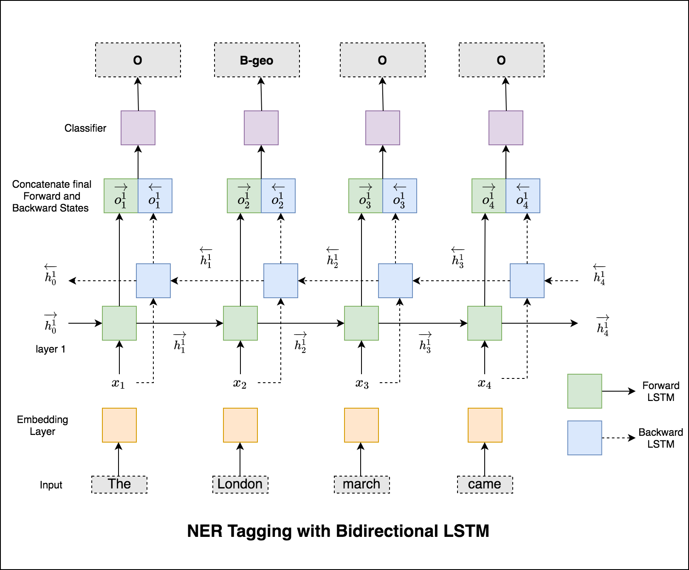
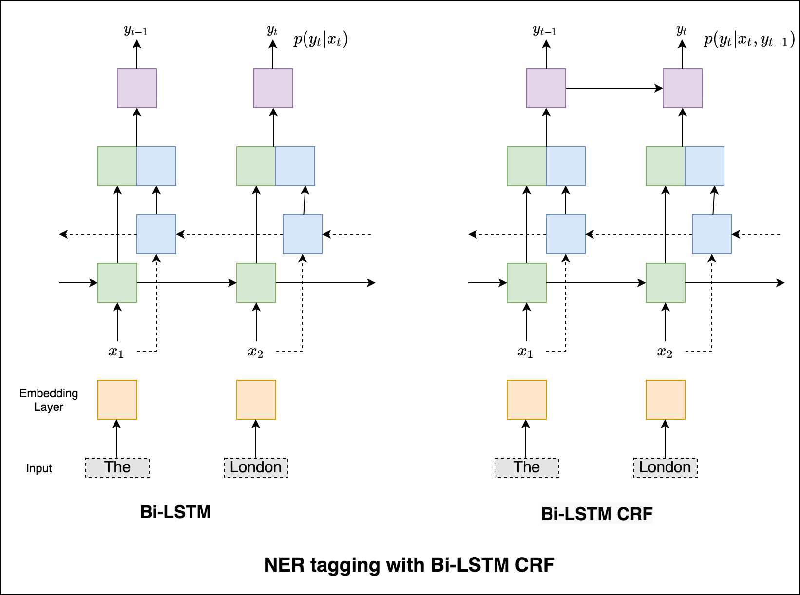
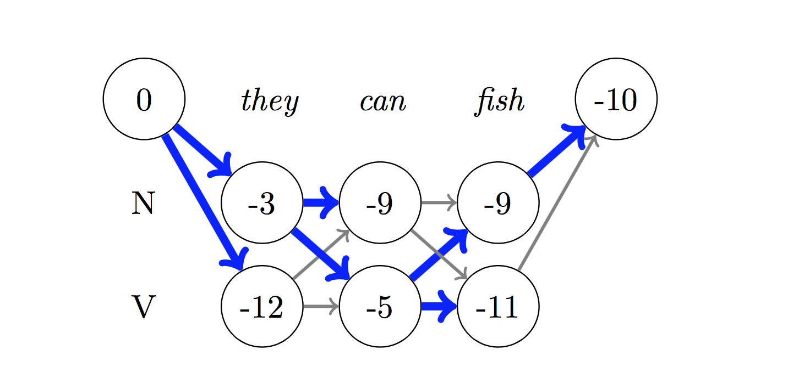
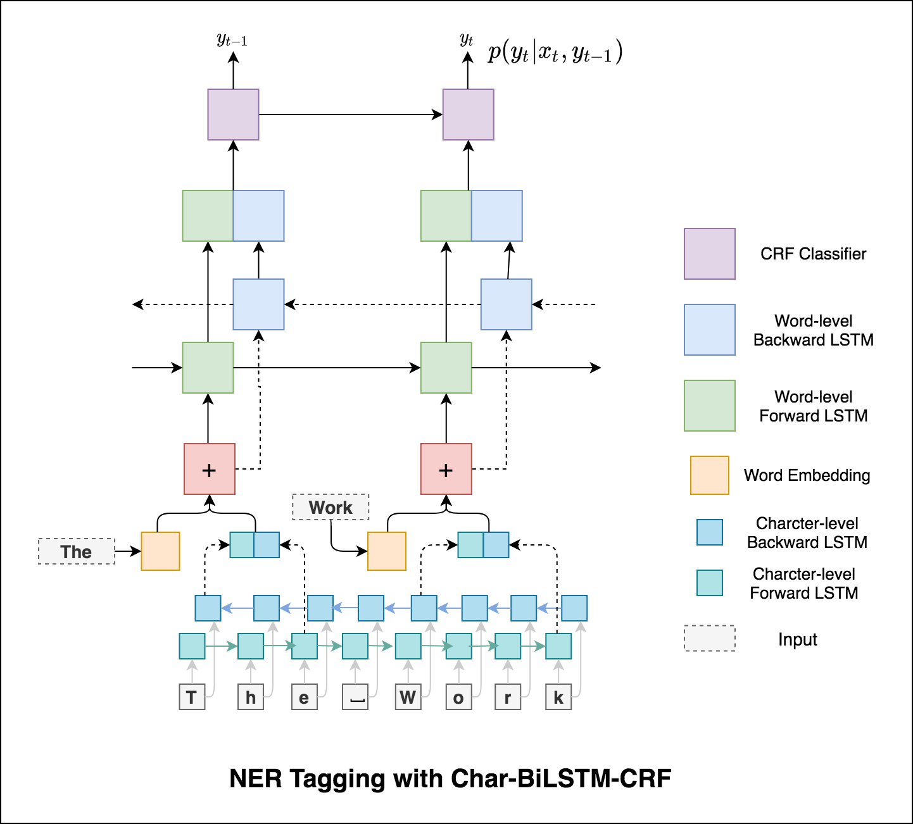

# NER Tagging

Named-Entity-Recognition (NER) tagging, is a task of labelling each word in a sentence with its appropriate entity.

## NER tagging with BiLSTM.ipynb

This code covers the basic workflow. We'll see how to: load data, create train/test/validation splits, build a vocabulary, create data iterators, define a model and implement the train/evaluate/test loop and train, test the model.

The model used is a Bi-directional LSTM network

The NER dataset is taken from [kaggle](https://www.kaggle.com/abhinavwalia95/entity-annotated-corpus) contains the following entities:

- `geo`: Geographical Entity
- `org`: Organization
- `per`: Person
- `gpe`: Geopolitical Entity
- `tim`: Time indicator
- `art`: Artifact
- `eve`: Event
- `nat`: Natural Phenomenon
- `o`: Other

A test accuracy of `96.7%` is achieved without the use of pre-trained embeddings. With that it might improve more.

*Note: Accuracy might not be a good metric as most of the data contains `O` tag. Different metrics like `precision`, `recall`, `f1` would give more insights.*

#### Resources

- [LSTM](https://github.com/graviraja/100-Days-of-NLP/blob/master/architectures/RNN.ipynb)
- [NER dataset](https://www.kaggle.com/abhinavwalia95/entity-annotated-corpus)

## NER tagging with BiLSTM-CRF.ipynb

In the case of Sequence tagging (NER) the tag of a current word might depend on previous word's tag. (ex: New York).

Without a CRF, we would have simply used a single linear layer to transform the output of the Bidirectional LSTM into scores for each tag. These are known as `emission scores`, which are a representation of the likelihood of the word being a certain tag.

Probability of a tag depends only on the input:

A CRF calculates not only the emission scores but also the `transition scores`, which are the likelihood of a word being a certain tag considering the previous word was a certain tag. Therefore the transition scores measure how likely it is to transition from one tag to another.

Probability of a tag depends on the input and previously predicted token:

For decoding, `Viterbi` algorithm is used.

Since we're using CRFs, we're not so much predicting the right label at each word as we are predicting the right label sequence for a word sequence. Viterbi Decoding is a way to do exactly this – find the most optimal tag sequence from the scores computed by a Conditional Random Field.

#### Resources

- [Medium Blog post on CRF (Must read)](https://towardsdatascience.com/implementing-a-linear-chain-conditional-random-field-crf-in-pytorch-16b0b9c4b4ea)
- [BiLSTM - CRF model paper](https://arxiv.org/pdf/1508.01991.pdf)
- [CRF Video Explanation](https://www.youtube.com/watch?v=GF3iSJkgPbA)
- [code reference](https://github.com/Gxzzz/BiLSTM-CRF)
- [Vitebri decoding](https://github.com/sgrvinod/a-PyTorch-Tutorial-to-Sequence-Labeling#viterbi-decoding)

## NER tagging with Char-BiLSTM-CRF.ipynb

Using sub-word information in our tagging task because it can be a powerful indicator of the tags, whether they're parts of speech or entities. For example, it may learn that adjectives commonly end with "-y" or "-ul", or that places often end with "-land" or "-burg".

Therefore, our sequence tagging model uses both

- `word-level` information in the form of word embeddings.
- `character-level` information up to and including each word in both directions.

